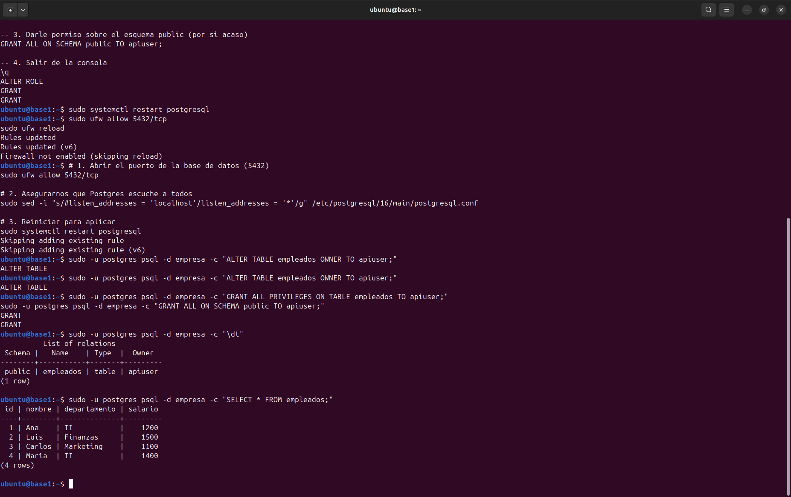
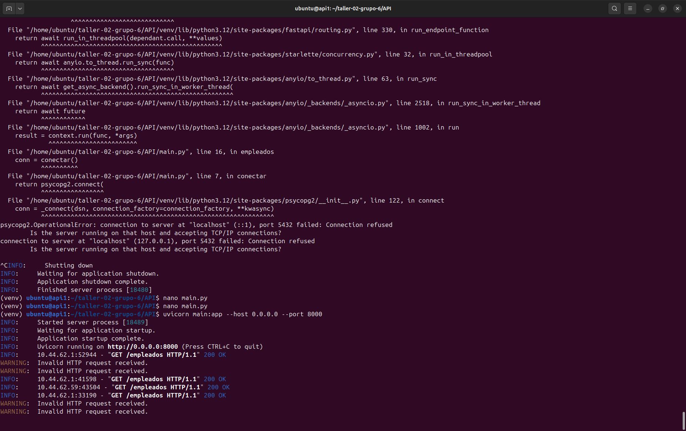
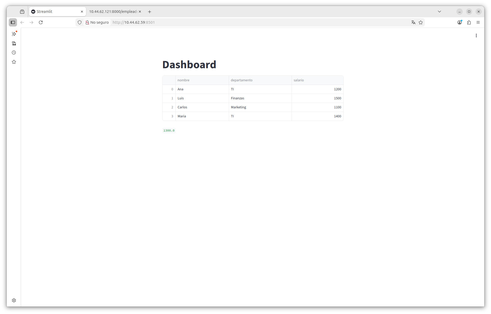

# Informe de Evidencias - Taller 02 (Grupo 6)

## 1.base1
Se verificó la base de datos PostgreSQL con los registros de empleados.

## 2.api1
Logs de la API FastAPI respondiendo correctamente (200 OK).

## 3. visualizacion1
Dashboard final en Streamlit mostrando la tabla de datos.

